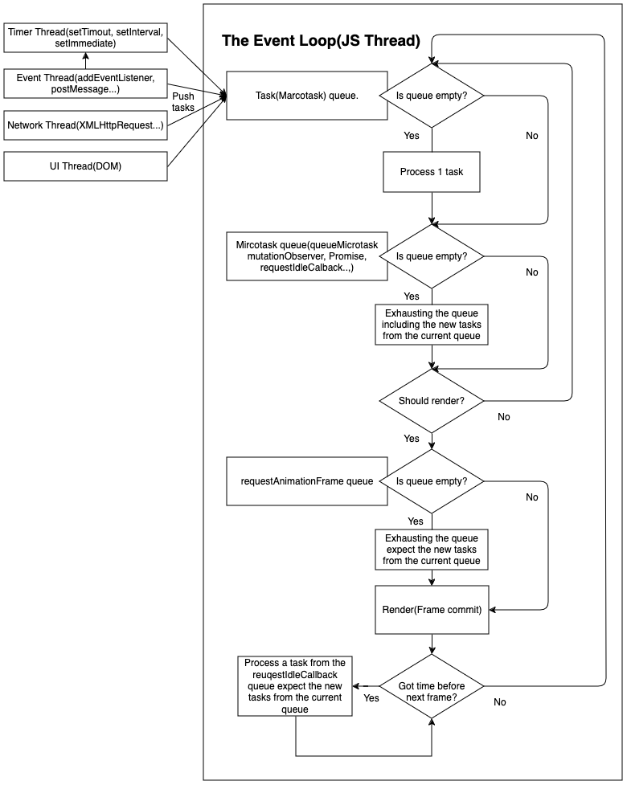
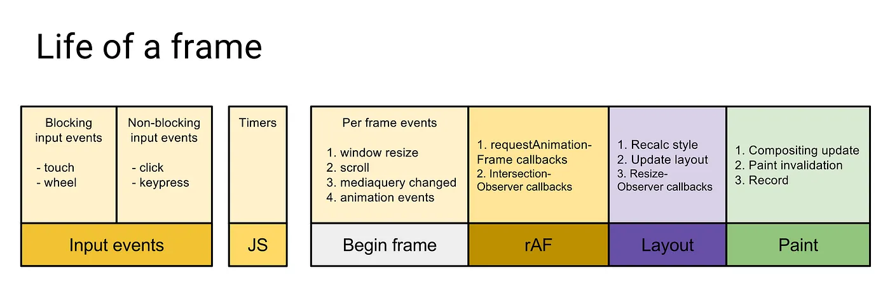

## 前言
最近被問到 Microtask 和 Marcotask 時發現自己對 Event loop 的理解似乎不是很全面，找了網路上一些文章感覺講得也不是很全面，直到看到這個演講才算解惑:



這篇文章是我的理解和整理，因爲對 W3C 原文定義理解困難，所以這理解主要來源是上面的這個影片和其他講得不是那麼全面的文章，所以不一定全對就是。

PS： 注意規範中沒有 Marcotask 這名詞，只有 Tasks，但大家好像都約定成俗的稱爲 Marcotask 作爲 Mircotask 的對比，下面跟隨習慣用 Mircotask。

## Event Loop
要理解 Event loop 首先要理解的是 Javascript 是個 single thread 語言，被設計成 single thread 原因很容易理解，主要是因爲 JS 其中一個主要功能的是對 DOM 做操作，如果有其它語言經驗的話，應該可以知道有 mulit threads/processes 的語言對文件的 IO 處理有多麻煩，不了解的可以去查一下 `File lock between threads and processes` 關鍵字。Event loop 則是爲了在 single thread 環境下模擬多工而設計出來的解決方案， single thread 的好處是可以讓寫程式變得比較簡單，壞處是只能同時做一件事，舉例來說就像超商只有一個店員，那個店員在微波食物食物時就只能呆等無法做結帳等其它事情，你可能會想不對啊，微波時把食物放進去定好時間後可以做其它事情啊，對，想像微波食物這件事就是一個 `async` 如 `fetch` 的工作，結帳是如 DOM 操作 sync 工作， 店員還是只有一個，但透過一些合理的安排他可以做到類似多工的效果，Event loop 就是設計來這種模擬多工成爲可能。

瀏覽器顯示畫面的步驟如下圖([Source](https://web.dev/articles/rendering-performance))：


這邊要注意的就只有第一個步驟，也就是 Javascript，其它的需要另開文章才能講完，以下會把其餘步驟簡稱爲 Rendering。Event loop 說穿了就是把工作碎片化，主要是不要被不是 JS 做的工作擋住，例如下載等其實是讓瀏覽器的其它 Thread 做的，所以在趁下載時 JS 就可以做其它工作，而不是一直再等其它 Thread 做完才能動，但是這是假多工，所以如果當其中一個 task 耗費太多資源時(例如無限迴圈)還是會擋住其它工作。

Event loop 流程圖(原創 [CC BY-SA](https://creativecommons.org/licenses/by-sa/4.0/deed.en) 授權):


上圖可以看出瀏覽器除了 JS Thread 之外還有 Timer, Event, Network 和 UI Thread，Marcotask queue 基本上除了 JS 程式外就是包含這些 threads 產生的 tasks，例如如果 JS 有加了某個 Element 的 click callback 的話，Event thread 會在使用者點了該 Element 的時候塞 task 進來，然後瀏覽器會在每次 Event loop tick(每一次循環被稱爲 tick) 中從 Marcotask 中選一個 task 來執行，理論上爲了使用者體驗，Event 相關的 tasks 會比較優先，之後就會執行 Microtask queue 中的所有 tasks。來看一下例子:

```js
console.log(1)
setTimeout(function() {
  console.log(2);
});
requestAnimationFrame(function () {
  console.log(3);
  requestAnimationFrame(function () {
    console.log(4);
  });
});
requestIdleCallback(function () {
  console.log(5);
});
new Promise(function(resolve, reject) {
  console.log(6);
  resolve(7);
}).then(function(val) {
  queueMicrotask(function () {
    console.log(8);
  });
  console.log(val);
});
console.log(9);
```

具體執行步驟是:
1. JS 引擎 parse 這段程式把它塞到 Marcotask 中後開始執行。
2. 執行第一行印出 1
3. 執行 setTimeout，把該 callback 塞到 Marcotask queue。
4. 執行 `requestAnimationFrame`，把該 callback 塞到 `requestAnimationFrame` queue。
5. 執行 `requestIdleCallback`，把該 callback 塞到 `requestIdleCallback` queue。
6. 執行 new Promise 印出 6，注意這段是 sync 而非 async。
7. 執行 then，把該 callback 塞到 Mircotask 中。
8. 執行最後一行印出 9，此時步驟 1 中的 Marcotask queue 的 task 已經執行完畢。
9. 接下來執行 Microtask 中的所有 tasks，也就是步驟 4 塞進來的 task，印出 6，此時 Marcotask queue 中的所有 task 已經執行完畢。
10. 開始執行 `requestAnimationFrame` 中的 tasks，印出 3，執行其中 `requestAnimationFrame` 把該 callback 塞到 `requestAnimationFrame` queue。
11. 開始 Rendering。
12. 此時要看此時 JS thread 忙不忙，如果忙的話就會忽略 `requestIdleCallback` queue 中的所有 tasks，相反則執行，所以會有兩種結果，一是在該 tick 中執行，二是排到下一個 tick。
13. 此時此 tick 中的所有步驟已經全部執行完畢，進入下一個 tick，開始執行 Marcotask queue 中的其中一個 task 印出 2。
14. 執行步驟 10 中被塞到 `requestAnimationFrame` queue 的 task。
15. 如果步驟 12 的 `requestIdleCallback` queue 沒被執行的話，此時就會執行。

筆者測試中就得出幾種結果：

1. `1, 6, 9, 7, 8, 3, 5, 2, 4`
2. `1, 6, 9, 7, 8, 3, 2, 5, 4` 
3. `1, 6, 9, 7, 8, 2, 5, 3, 4`

會有多個不同結果的原因是因爲 `requestIdleCallback` 和 `requestAnimationFrame` 這兩個是不穩定的 API ，上述步驟就只是理論上的情況，現實中它們的執行是非常取決于當下環境的，`requestAnimationFrame` 只會在有需要 render 時會被執行，有時候畫面就沒有動沒有更新所以該 tick 中就不會執行，`requestIdleCallback` 就只有在該 tick 中有空閒狀況時會被執行。

* `requestAnimationFrame`(rAF) 較具體的執行時間點([Source](https://medium.com/@paul_irish/requestanimationframe-scheduling-for-nerds-9c57f7438ef4))：



* `requestIdleCallback` 較具體的執行時間點([Source](https://developer.chrome.com/blog/using-requestidlecallback))：


### UI thread 和 JS thread
UI thread 和 JS thread 雖然是各自獨立的 thread，UI 更新時 JS 並不會執行，相對的 JS 在執行時 UI thread 也不會做 render。這樣可以避免例如 UI 在更新時 JS 修改 DOM 導致無法預測的衝突發生。

### Fetch
上面說了 Network 另一個 thread，所以 XMLHttpRequest 是 Marcotask，但 fetch 用的是 Promise，也就是 Microatsk，這看起來很衝突對吧？但其實可以理解爲 fetch 只是對 XMLHttpRequest 的包裝，針對 XMLHttpRequest 的回傳是 Marcotask 沒錯，只是從中再回傳一個 Promise。可以參考常見的 Polyfill 來理解([Source](https://medium.com/@sohammehta56/javascript-fetch-method-and-its-implementation-fetch-polyfill-4cfb880949e6))：

```js
function Fetch(url, options) {
    return new Promise(function(resolve, reject) {
      var xhr = new XMLHttpRequest();

      xhr.onload = function() {
        // Check for HTTP success (status in the range of 200 to 299)
        if (xhr.status >= 200 && xhr.status < 300) {
          resolve(new Response(xhr.responseText, { status: xhr.status }));
        } else {
          // Create a new Error object with more information
          var error = new Error(xhr.statusText);
          error.response = new Response(xhr.responseText, { status: xhr.status });
          reject(error);
        }
      };

      xhr.onerror = function() {
        reject(new Error('Network error'));
      };

      // open(method, url, async)
      xhr.open(options.method || 'GET', url, true);

      // We must call setRequestHeader() after open(), but before send().
      for (var header in options.headers || {}) {
        xhr.setRequestHeader(header, options.headers[header]);
      }

      xhr.send(options.body || null);
    });
};
```

### 實作中建議

1. `setTimeout` 或其它 Marcotask，執行很重要的程式，不希望會被該 tick(frame) 中其它程式影響。
2. `queueMicrotask` 或其它 Microtask，相對沒那麼重要且較小型的程式
3. `requestAnimationFrame` 應該用在跟 render 相關的狀況，如 DOM 操作。
4. `requestIdleCallback` 用在很不重要的程式，例如分析使用者行爲之類的。

#### 參考：

* [Tasks, microtasks, queues and schedules](https://jakearchibald.com/2015/tasks-microtasks-queues-and-schedules/)

* [我知道你懂 Event Loop，但你了解到多深？](https://yeefun.github.io/event-loop-in-depth/)

* [requestAnimationFrame Scheduling For Nerds](https://medium.com/@paul_irish/requestanimationframe-scheduling-for-nerds-9c57f7438ef4)
* [Using requestIdleCallback](https://developer.chrome.com/blog/using-requestidlecallback)

* [Picking the Right Tool for Maneuvering JavaScript's Event Loop](https://macarthur.me/posts/navigating-the-event-loop/)

* [Why is a XHR Request treated as a macro-task while a Fetch request is treated as a micro-task?](https://stackoverflow.com/questions/74182571/why-is-a-xhr-request-treated-as-a-macro-task-while-a-fetch-request-is-treated-as)


