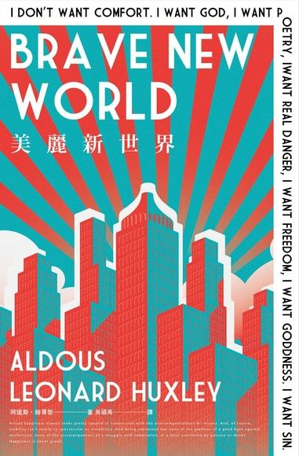

這本被稱爲世界三大反烏托邦之一的書對我來說卻不怎麼反烏托邦，反而比較像在探討價值觀衝突，應該說作者本人的確是想傳達反烏托邦的概念，這本書出版年份是1933年，離世界共產黨、蘇聯的成立並沒有很久，而且作者是個老右派，在那個年代這的確是本反共(反烏托邦)的書, 但以現代的觀點來看，我個人覺得反而比較像在反反烏托邦。書中開始描述了該「烏托邦」在人出生以前就已經安排好其在社會中該擔當的位置階級，描述情況確實比較極端，但回頭來看現代社會在資本主義發展到這階段，貧富差距階級固化/世襲現象難道就跟書中描述的有很大差別？差別就在於書中的做法已經是制度化把流動的機率降到儘可能的小，而我們所處的世界還是基於因爲「自由市場」而還容許部分例外，但越是發展成熟的國家，流動率就越顯著減少，再發展下去要達到書中的程度應該不會是問題，當然即便達到那種程度，還是有差別，一是書中的固化是管理者的刻意爲之，鍋是管理者要背，而現代社會的固化是整個社會有意無意的促成，鍋要整個社會背；二是書中的人階級雖然都被安排了，但因爲有經過刻意的「訓練」，被安排的人思想上其實不會有相對剝削感，就像古代百姓看到皇帝會自認奴才一樣覺得天經地義，而且爲了整體社會的穩定，管理者也安排相對應的娛樂方式，要說的話，書中即便是最基礎的階級，其實生活過得基本上比現代的一堆中產還要好和快樂多了，衣食住行都不缺，截自書中的一段話：

> 「可怕？他們並不覺得。相反的，他們喜歡。那是輕鬆的，像孩子的工作一樣單純。心力體力都不須緊張。七個半鐘頭溫和的勞動，然後是蘇麻分配和種種運動與遊戲，以及沒有限制的交媾和感覺電影。他們還能更有什麼要求？」

整本書我覺得最有意思的一部分大概就是管理者和野蠻人最後的對話了，野蠻人因爲看了莎士比亞而不斷的在追求善與美，但以管理者的理論來說善與美是不必要的，他們其實是相對的，因爲有惡才會有善的存在，如果世界上沒有惡霸，沒有不公，那就不需要英雄的存在：

> 「文明絕對不需要高貴與英雄行為。那些東西是政治缺乏效能的症狀。在一個像我們這樣組織良好的社會，沒有任何人有任何機會做高貴的或英雄式表現。在這些機會產生以前，社會必然已經變成澈底不穩定的狀態。在有戰爭的時候，在有聯邦互相對立的時候，在有誘惑需要抗拒的時候，在有愛的對象需要去保護或為之而戰的時候──那麼，顯然，高貴的與英雄式的行為就具有它的意義。但是現在沒有任何戰爭。而且社會也盡了最大的力量來防止你過分的去愛任何人。在這裡沒有分裂的聯邦；你受到如此的制約，以至於你自動去做你應當做的事情。而你應當做的事情，又是那麼令人愉快的，你的自然衝動有那麼多可以自由發洩，以至於根本沒有任何誘惑是要你去抗拒的。」

> 「因為我們的世界跟奧賽羅的世界已經不同。沒有鋼鐵你不能製造小汽車──沒有社會的不安你也不能製造悲劇。世界現在是穩定了。人民快樂；他們得到他們想要的，而凡是他們不能得到的他們也絕不想要。他們現在是一帆風順；是安全的，永遠不生病；他們不再懼怕死亡；他們幸福的忽視了熱情與衰老；他們不再遭受父親或母親所加給他們的災難，他不再有太太，不再有孩子，也不再有愛人讓他們發生強烈的情感；他們澈底受到制約，以至於凡是他們應當去做的他們就心甘情願的去做。如果有什麼事情出差錯，還有蘇麻在；而這就是你借著自由之名把它們從窗子丟出去的東西，野蠻人先生，自由！」

簡單來說書中的烏托邦就是制度相當完善的社會，幾乎完全消除個體之間的不平現象，科學發展到不會有資源短缺，因此不會有不公不義，也就沒有出現英雄或好人的需要，所以烏托邦中也沒有善美的存在，因爲相對的惡醜並不存在，也沒有劇情精彩的電影或故事，因爲通常來說精彩的故事劇情需要有高低起伏好人壞人悲劇等等因素，然而烏托邦沒有這些現象的存在，每個人一生都是舒服快樂且平淡的，不會有大的情緒波動，不會大笑也不會哭泣，因此對於那些劇情即便看了也不會有任何的感覺。其實作者身爲老右派可以對烏托邦有如此的理解還蠻讓人驚訝的，可以思考一下我們現代的社會所追求的法治制度公平正義所想要達成的理想狀態不就是書中的狀態嗎？我們要如何說它不好呢？我們常常看到一些說法生命因爲有好的壞的所以才精彩，但這種說法往往來自第一世界社會，常常是吃飽了撐着的人說出來的，真正的第三世界的人爲了生存完全沒心思在思考這種事情，當從90分掉到70分或許會把它稱爲精彩，但一直從0分到2、30分之間擺動，我相信沒有多人願意稱之爲「精彩」，我們真的要因爲有所謂的「精彩」而犧牲大部分人口最基本的生存權嗎？當然即便烏托邦也不會是完美的，書中的烏托邦還是有它的問題在，就連作者也不自覺的沒提到，那就是管理者，根據描述管理者似乎是一種獨裁的存在，而且看起來也沒有所謂的制約來控制其思想保持統一一致，難保不會出現某一任把一切都破壞了，但烏托邦也似乎無法容許民主制度的存在，我能想到唯一的解法大概就只能依賴機器人了。

總結來說，整本書談的就是野蠻人和管理者的價值觀之爭，因爲想要有所改變而容許不公不義的存在 VS 公平正義穩定高於一切。最後想嘴一下的是，野蠻人的價值觀其實就是完全從看莎士比亞培養出來的，其中一些例如忠貞等觀念在現代社會也是屬於被遺棄的狀態了，個人是很懷疑莎士比亞的影響力真的有大到有如宗教般把野蠻人束縛的如此深，深到不惜犧牲一切也要守護？
