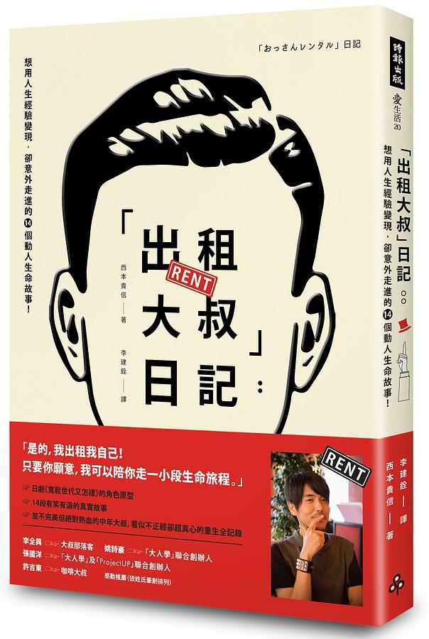

雖說知道這個「行業」已經許久，但一直以爲跟漫畫或遊戲看過的一樣就只是做雜事的工作，結果在誠品翻了一下後發現不是那麼回事，大家似乎都把他當成傾訴的對象XD，而且內容看起來算有趣價格也還算便宜，所以就把它買下來直接在誠品咖啡廳直接看完了，這算我第一本在同一天內做到從買+看完的書，而且還在兩小時內，相信這記錄之後應該不太好破QQ。

首先要說的是，本書的頁數和內容其實算少，就如上面說的大概兩個小時內可以看完，而內文有提到大叔在當時至少接了900多個委託，結果只生出14篇故事？然後感覺還有點硬湊頁數的感覺？可以合理懷疑這工作搞不好沒有像書中說的那麼有趣？但也有可能是作者太忙沒時間整理？

下面開始劇透區塊，不想看的可以跳過直接看再下面，但其實我覺得類似的書看原文敘述跟一些細節比較能帶出那種感覺，有無劇透感覺不是很重要就是了，所以要不要看就自己斟酌吧。

---------------劇透部分開始----------------

書中有幾個讓我比較有印象的故事，其中一個就是序章裡老婆婆的故事，這是作者唯一提到他期待的工作，幾乎每週都固定會有一次，表面的工作就是陪她散步，但其實真正而言是陪她聊天，或者說聽她講她跟她已過世丈夫的故事，老婆婆每次講完一定會說讓我有所觸動的話：「好想再見他一面，即使投胎轉世，也要跟他在一起」，人生如果可以找到這樣的另一半，感覺就真的死而無憾了吧？

第二個是一個社會新鮮人不知道要怎麼跟前輩大叔們溝通，作者就教說大叔要的其實很簡單，就只要聽他們講話，附和就夠了，至於要怎麼開話題，聽多了就可以知道每個人的興趣的狀況，收集夠了就可以帶話題，我自己則覺得乍看之下感覺是個好技巧，但彼此興趣跟狀況不太可能一樣，硬要找資料找話題感覺也太勉強了

第三個嚴格來說不是故事，就只是遇到的委託內容讓作者想到他母親臨死前的遺言：「做自己喜歡做的事」，我媽雖然沒說出口這句話，但其實也是這樣放生我，只是我覺得比較多是她自覺沒能力去干涉吧，只好讓我自生自滅的感覺。

---------------劇透部分結束----------------

讓我覺得作者很厲害的第一點就是，他有帶出現代年輕人的煩惱，以前他那個時代的人要做什麼可以做什麼基本都有一定的套路，而大部分人也都很認命跟着做，當然也會有不認命的，我們常看的電影或故事就是這些不認命的人用自己的人生寫出來的，到了現代講求自由發展，充滿選擇，但也造成部分甚至很多年輕人都不知道該做什麼，可以做什麼，陷入迷惘，「可以自由活着，那又如何」這其實也是一種煩惱。這讓我想起少子化議題，以台灣的統計來看，其實大部分人結婚後都至少會生一胎，至於爲什麼生育率會跌破 1 的原因主要還是很多人都無法找到另一半結婚，印象中根據統計 30 歲以上台灣人有四成以上都單身，當然這裡的單身只是不是在結婚狀態，不代表真的是單身，只是我的經驗來說，以前要找另一半結婚其實相對容易很多，非網路時代大家認識對象除了生活中會遇到的人之外就是筆友之類的，遇到的人有限，生活圈子小，認知有限，不太能突破同溫層，所以也不太能有什麼比較，大家都會比較認命，到了現在網路社群時代，有着大量的資訊，大家的認知都更廣了，選擇多了起來也更容易比較，雖然不一定能得到，但既然知道有更好的，人性就是會想要更好的，所以就找不到合適的人結婚的人就多了。關於「選擇」這件事又讓我想到有陸續在書店翻過但還沒決定要不要買來看的「選擇障礙世代」，這本書的作者給出的其中一個解法是跟在地社群或人建立關係，出租大叔的作者也提到年輕人渴望跟人溝通，但不懂怎麼建立關係，兩者剛好提到類似的論點，或許建立關係可能是突破選擇障礙的點？

回到出租大叔這份「工作」，因爲這本書出版已經是2017年了，所以在寫這篇心得的時候有稍微找過台灣這邊有沒有做起來的，結果發現好像沒有很成功的，少數找到的案例好像都是從本身的人脈開始，而且也自我受限定爲成聊天/諮詢(原作的大叔可是預設什麼都做啊，包含街上搭訕女生)，也不知道現在還有沒有持續在做，而日本方面，創始者作者本身的個人網站也上不了了，但發現居然有那種可以自己「上架」出租大叔的網站，就是有很多大叔任君挑選，只是到底熱不熱門就不知道了。剛看完書之前感覺確實很有趣，有稍微心動了一下想要把自己租出去，但現在想想這行業要做得起來大概有三個要點，一是社會治安要良好，陌生人之間才會有一定程度的信任感、二是社會要有付費買時間的概念、三是國家都市化程度要夠，越都市化寂寞/孤立人口就會越多，要多到可以養起這類行業，台灣的話大概有達到第一個條件，第二個我則很不看好，就算日本作者也被酸過不少次錢很好賺，台灣這邊人力跟時間的便宜程度就能夠看得出來，第三的話不太好說，夠不夠的數字我不太能捏XD，但結果論來看，台灣過了好幾年，也不乏嘗試者，但就是沒做起來，大概是真的沒滿足到條件吧。

最後，這心得沒提到的是，書中有不少篇幅是作者大叔自己的心路歷程，畢竟書名就有日記兩個字，內容算還好，但我實在劑不出心得，所以就這樣吧XD

