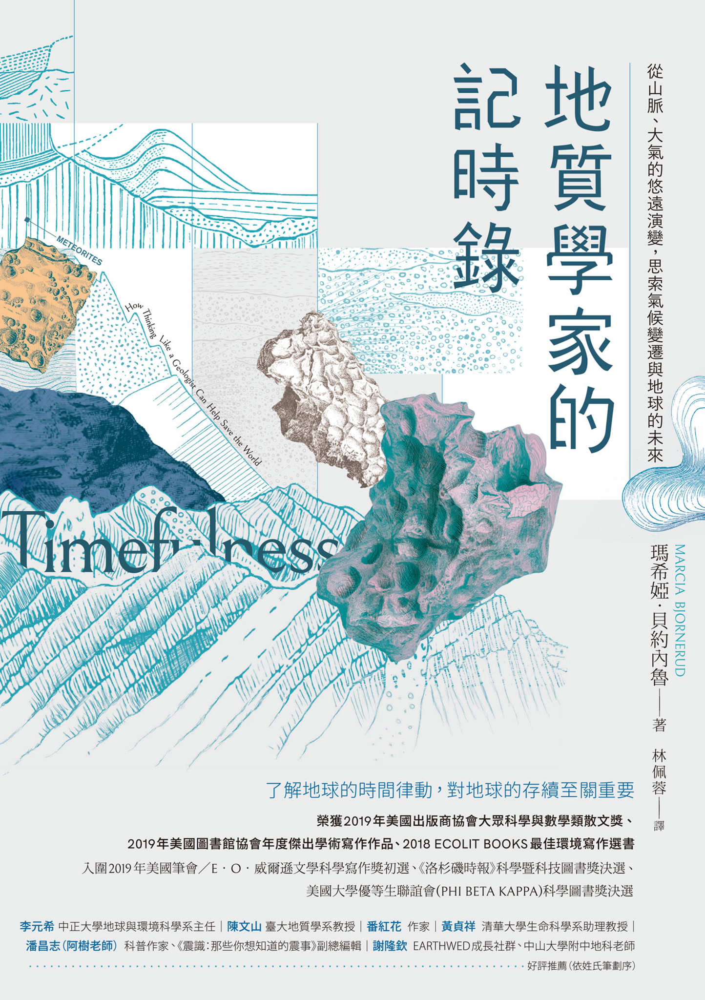

買的時候沒有注意到副標題，以爲是純地質學的科普書，後來才發現內容有涵蓋了氣候變遷，幸好篇幅不大，主要內容還是用地質學來訴說地球歷史

首先要說的是作者對於自己非自己專業領域感覺上有不懂裝懂的嫌疑，例如有一段：

> 如今可以一笑置之的的「Y2K」危機，在千禧年之交可是有癱瘓全球電腦系統及世界經濟之虞。而危機的成因在於，一九六〇，七〇年代的程式設計師顯然真的不認爲西元二千年會有到來的這一天。

身爲碼農的我可以負責任的說，這成因其實是一開始電腦存儲的成本很高，有點年級的應該會記得磁碟機的時代，那時候的容量還不到 1MB， 更何況一開始用兩位數年份的 1960 年代，這算是當時很明智節省資源的好做法，這些程式設計師不是不認爲西元二千年不會到來，而是不認爲自己寫的程式會活到那時候，雖然說早期的程式迭代速度沒有現代那麼快，但我也不認爲當時的程式設計師會認爲自己寫的程式可以活 30、40 年而中間不會被自己或後人修改，雖然後來存儲成本已經不是問題，但程式的迭代速度更快了，所以活不到 2000 年的思維也可以理解，只是 90 年代的時候還沒改確實是程式設計師的問題，但也不盡然全是是程式設計師的鍋，當時的年份設計往往實作在底層，就要改的牽連廣泛程度而言，我不認爲會有人願意在還沒迫切情況下要把一堆已經在運作良好的程式大規模更新，到這種地步很多時候不是負責動手的程式設計師說了算的。

另外一段：

> 身處二十一世紀，如果一位受過教育的成人無法在世界地圖上辨識出各大洲，我們會大概詫異

這作者很明顯是活在自己的學術圈同溫層裡，大家自己去問問看身邊有大學學歷的朋友，直接給個沒有任何國家名字的地圖，看有多少人辨識得出來，就連作者自己的國家美國在如今跨國飛行成本有史以來最低廉的時代，僅有 30% 的人擁有護照，更別提一輩子都沒出過自己出生州的人更不在少數。這樣的情況下有受過教育的成年人辨識不出各大洲需要感到詫異？

雖然說上述的問題幾乎都只是舉例輔助用，並不影響書中要表達的，但還是讓我對書中的內容持更保留的態度。

雖然我不是相關領域的專業，對其嚴謹程度無法做評斷，但作爲一個科普書，其敘述的方式不太會讓人覺得太硬無聊，作者在說可以跳過的第二章其實滿滿的乾貨，敘述了地質學的發展歷史，從如何認識到土地岩石從恆古以來就一直在變化，而且年齡也比一開始人們想象中還要古老，到後來檢測工具的發展，劃分地球歷史的紀元等等都有簡淺易懂的介紹。

#### 檢定方法

看到一些發現化石之類的新聞時，常常會有人質疑這些科學家到底是怎麼知道多久以前的，會不會是在唬爛，但其實這些檢定方法是花了數十年才發展出來，有堅實嚴謹的科學根據，一開始地質學還沒發展成熟的時候，用的方法是以化石作爲指標，地層沉序跟找到的化石比對搭配來劃分紀元，但這個方法受限於到了某個深度的底層後就找不到化石，無法追溯到寒武紀以前的年代，當時有一堆比寒武紀早的岩石就被歸類到「前寒武紀」，一直到物理學發展出來的放射性元素鑑定法才有所發展。地球上有很多物質都有放射性元素，放射性元素意思是在轉變成其它元素時會釋放能量，而釋放的的速率跟母元素的剩餘量成比例，簡單來說就是可以依照該物質裡面的某些同位素的比例來推斷到底衰變了多久，可以當作天然的時鐘，各種元素都有其衰變週期，有些很短有些比地球年齡還要長，例如銣 - 87，其衰變週期是490億年，比宇宙的年齡還要長，而比較廣爲人知的碳 - 14，因爲生植物活着的時候會吸收碳 - 14，但死後就會慢慢釋出，所以只要比對已死亡的生植物體內的其他穩定的碳元素比例就可以得知其生存的年份，但碳 - 14的半衰期期只有 5 千多年，沒辦法用來測定年代大於 6 萬年的物體，所以應用在考古學上比較多，而且因爲不同年代的大氣碳含量不同，會影響到生物體內的碳含量，單純用碳 - 14的來測定的不確定性比較大，所以有發展出用樹木的年輪或珊瑚的生長帶來輔助校正，但儘管如此，碳 - 14的不確定性還是有到 5 到 10%，而且冷戰初期的核爆測試釋放出了大量的碳 - 14到大氣層，還有人類開始燃燒化石燃料後，也改變了大氣同位素的混合比例，所以通常放射性碳會以1950年前作爲分割來定年。

> 註：半衰期跟衰變是不同的，書中有一段「這只代表自地球形成以來，銣 - 87 僅經過十分之一的半衰期，而且到目前爲止只有一小部分的初始銣 - 87 變成鍶 - 87」也許是我之前讀得不夠用心，也有可能是書中說明還有不夠詳盡的地方，額外上網查了一下才了解到其實半衰期的定義是「一個樣本裡面該元素衰變到剩一半」，所以當一半的銣 - 87 變成鍶 - 87 才算一次完成半衰期週期，而銣 - 87 衰變成鍶 - 87 需要 13 億年(銣鍶定年法)，至於說銣的 490 億年半衰期是怎麼算出來的書中也沒說明的樣子，稍微查了一下也不得要領T_T。

#### 地球的年齡

目前學界公認的地球年齡 45.5 億 +- 7千萬年，其實是由地質學家 Clair Patterson 利用比地球出生還要早的隕石以早期還沒成熟的放射性檢定法做對比首先算出來的，還爲此蓋了世界上首間無塵室。

#### 恐龍滅絕隕石說

造成白堊紀恐龍滅絕的隕石，其隕石坑在 1991 年找到了，用氬氬定年法證實其年齡就是在白堊紀末。

#### 鋯石恆久遠

地質學發現鋯石的韌性比鑽石還要強，鑽石再強終究還是會變成石墨，而已發現最古老的鋯石年齡是 44 億多年，只比地球年輕一些些。

#### 整個地球都是類有機體

地球是個大循環系統相信很多人都知道，像我其實對於大循環的認識就只限於地面+大氣層，但其實循環也包含到了地心，地幔會每隔幾億年透過對流，讓深處較爲炎熱和浮力較大的岩石上浮，而溫度和密度較低的岩石則會下沉來散熱。在整個過程中海底的海水有部分會因此被困在地殼中上億年直到板塊再活動時才會釋出。

> 岩石不是受熱，而是因為壓力下降而熔化。岩石和水不同。水是完全反常的化合物，多數人從中理解到的是三態變化的概念。但岩石的屬性和正常物質一樣：熔化時會膨脹，冷凝時會收縮。 這表示如果在地球特定深處，一塊岩石的溫度已趨近其熔點，而岩體受到減壓作用（例如上升至近地表處），則會傾向轉變成密度較低的狀態，也就是熔化，從而形成岩漿。此現象稱為減壓熔融（decompression melting）作用，只要減壓速度快於降溫速度，即使岩石實際上正在冷卻也有可能發生（對滑雪及溜冰人士來說，減壓熔融的概念尤其難以理解，因為水所呈現的相反物理現象──壓力「升高」時，冰塊會融化──是冬季運動時，地表會溼滑的基礎原理）。

過去我的認知山脈是板塊移動造成的，但實際上山還是不斷受到外部的力量侵蝕，例如風、雨、河流、冰河和重力等等，而侵蝕速度剛好跟板塊擠壓的速度卻很巧合的差不多，所以我們看到彷彿萬年不變的山其實是一直都在變動，大自然的力量不斷把山上的石頭沙土往下沖，地殼不斷把地層往上擠，有如人體細胞般緩慢卻不斷的在更新。而生物的進化其實也跟地形的變化息息相關，生物必須不斷進化適應地形與氣候的變化，像喜馬拉雅山脈等級規模的地形變化甚至會影響全球氣候，這些變動又會反過來影響地貌變化，相互影響，例如生物死亡後其含有礦物質的殘骸會降落到海底，進而形成石灰石，將大氣中的二氧化碳以固態的方式封存達千萬年之久。幸好地形的變化是久遠且緩慢的，要不然生物的進化速度就會跟不上，像人類的科技跟人數的發展速度太快就會有問題(參考: [失控的進步 — 復活節島的最後一棵樹是怎樣倒下的](https://blog.garyyeap.rocks/read/a-short-history-of-progress/)，作者在此章文末也警告人類如今的能力已經能短時間內做到地球花費好幾萬甚至幾千萬年才能做到的變化，請人類務必小心謹慎。

> 地震理所當然可以引發山崩。而儘管地震通常有助於山脈形成，但伴隨而來的山崩在某些情況下（例如2008年傷亡慘重的中國汶川大地震），實際上可能會抵銷地震觸發的地殼抬升作用。換言之，山脈景觀的生成與毀滅之間有著緊密相依的關係。而以影響山景生滅的作用力來說，長期的力量（均變而乏味）可能不如短期的力量（可立即引發恐懼）來得強大。有地質證據證明，遠古時期邊坡破壞的規模，遠大於人類史上所見過的任何邊坡破壞事件，而且規模龐大至極，彷彿是在差勁的末日科幻片中出現的離譜場景。例如，大約在七萬三千年前，在非洲西岸外海的維德角（Cape Verde）群島，有座火山島的側面發生了規模龐大的塌陷，繼而引發海嘯，將重達九十公噸的巨石拋到五十公里外另一座島嶼的側邊，落在一百八十公尺高之處。
>
> 大多數的人都知道，黃石公園是坐落在休眠的超級火山之上，而這座火山曾經以意想不到的巨大規模爆發。但就在這座公園外，有一座山脈記錄著一場更加震天駭地的遠古大災變。懷俄明州的「心之山」，曾經屬於一塊厚達一．六公里，相當於羅德島州大小的石板。這塊石板也許是在其底部過熱的氣體幫助之下，在三十分鐘內滑過了一道平穩得出奇的坡面，距離超過五十公里──也就是以行駛在公路上的速度滑行。
這些規模超級巨大的事件提醒了我們，人類的觀測窗口十分狹隘，無法讓我們完整目賭地球的運作機制。這些事件也暗示著，我們所認為的「正常」地貌作用，可能實際上比較像是救災人員在災害發生後，試圖將基礎建設恢復原狀的過程。
>
>了解地形驟變所遺留下來的影響十分重要，因為我們自己現今就是地貌遭受摧殘的幕後推手。為了開採煤礦，業者會採取所謂「移除山巔」（mountain top removal）的作法──看上去還以為是一項手術名稱。此種作法所移除的岩石量，可與規模最龐大的自然災害匹敵。在阿帕拉契山脈的部分地區，舊有的地形圖已變得毫無實際參考價值。2016年一項針對西維吉尼亞州南部突變地貌的研究發現，自1970年代以來，業者自山頂移除了多達六．四立方公里「超過負載」的廢石，並將之傾倒在溪谷的上游。所移除的岩石量，相當於恆河和布拉馬普特拉河（流經地表最巨大山脈的兩大河）在十年間運往孟加拉海底扇的沉積物總量。而這還只是西維吉尼亞州南部的廢石量。
地貌遭受到如此大規模的侵擾，將會產生範圍廣泛且極為長久的影響。樹木原本在岩床上方固定土壤之處，如今堆滿了數百英尺厚的碎礦渣，將山坡覆蓋起來。在大自然中，河川會不斷形塑山坡，直到達成均夷（graded）狀態為止，也就是坡度剛好夠陡，可讓河川的流速跟上山谷沉積物堆積的速度。在阿帕拉契山脈遭到毀壤的山谷中，高原處的小溪流填滿了沉積物，必須奮力不懈地處理巨量的廢石。這些溪流要花費多久的時間才能將廢石處理完畢，實在難以估算，因為歷來幾乎未曾有過諸如此類嚴重失衡的地質現象，但要耗費數十萬年或許只是保守的估計。若是再預測廢石對地表與地下水的化學性質會有何長短期影響，原生動植物又會遭逢何種命運，結果恐怕同樣值得世人大為警惕。而人類處在削除了頭顱的山影下，心理上所受到的影響更是無法計量。
>
> 目前人類在全球各地所搬移的岩石和沉積物，包括經由刻意（比如採礦等活動）與無心（透過農業活動與都市化加快地表侵蝕速度）的作為，超過了地球所有河川的搬運總量。如今已無法再假設大自然的地理特徵，可以反映出各種地質作用的結果。在僅僅數年間，中國政府便徹底改造了南海南沙群島的地貌，刮除海底的珊瑚礁質來建造新島，與敘爾特塞島的誕生形成反烏托邦式的對比。在英格蘭南部，著名的白堊斷崖（chalk cliff）後移的速度，已從每年數英寸加快至數英尺，這是人類改造海岸線，加上氣候變遷導致海水入侵、風暴強度增加所造成。由於亞斯文（Aswan）與其他水壩阻斷沉積物的流入，尼羅河三角洲目前逐年下沉二．五至五公分。而幾項碰巧相互牽連的事態，形成了所謂的「完美風暴」註73，造成路易斯安那州沿海地區每小時便流失一英畝的土地：貫穿北美大陸的密西西比河航道系統工程，已使得沉積物的供給量驟減，與此同時，石油和天然氣的開採造成地層下陷──而就在這段期間，海水剛好也無情地上升（這是消耗石油與天然氣所間接導致的後果）。註74同時，在奧克拉荷馬州，我們再次喚醒了休眠已久的斷層。我們為了開採石油與天然氣而採用液裂法（hydrofracturing），其所產生的廢水灌入了地底深處，繼而引發地震。
>
> 人類對地球形貌的改造，達到史無前例的規模，這也是人類世概念的論證之一。人類世代表了地質年代的一個新分野，它的特徵在於，人類的出現形成了廣及全球的地質作用力。我們確確實實正在改變各個大陸的面貌，以及重塑世界地圖的樣貌。但就一個地形種類繁多，而且不斷消除舊有地貌，以新地貌取而代之的星球而言，此種改變是否事關緊要？對地球本身來說，的確是無關緊要，因為地球最終將隨其本身喜好，以緩慢漸進抑或是引發大災難的方式，重新塑造世間萬物。

註：檢測山土流失狀況可以用「核飛跡定年法（fission track dating）」

#### 大氣層

其實大氣的出現是微生物製造出來的，生物是形塑大氣層的關鍵，生物不斷的在改變大氣結構，大氣偶爾的劇烈變化也帶來生物的滅絕，周而復始。而地球大氣的變化可以從地質和南北極歷史久遠的冰塊里封存的氣泡觀察出來。值得注意的是元古宇宙其中有10億年被稱爲「無聊的10億年」，這10億年中微生物們似乎停止了進化，但作者認爲是因爲這些生物們進化到了一個可以形成供需平衡的狀態，某一群微生物製造的廢料，成為了另一群微生物製造的原料，簡單來說就是達到某程度永續的狀態，這點是值得人類參考的一個範本。

#### 雪球地球
無聊的十億年結束後，地球進入了雪球地球時期，作者在這裡似乎有寫了原因但用的語句感覺又不太像是在寫原因，這可能是翻譯的問題，反正好像是地殼系統把所有大陸聚成一大塊在赤道附近的大陸，地質學家把它稱作「Rodinia 大陸」，Rodinia 在俄文中是祖國的意思，這塊大陸大概存在了五千萬年(作者形容爲暫存於世...可見地質學的時間跨度)，之後就開始解體，解體的過程在熱帶地區造就了遼闊的海岸線，因爲海岸線的增加(作者沒與這樣講，我猜的)，雨水會把沉積物和岩石釋出的元素衝進海底讓有機碳大量被埋藏，進而降低大氣層的二氧化碳濃度，地球順勢邁入冷卻期導致海冰開始聚集，而海冰會增加對陽光的反射率，導致地球更進一步冷卻，最終進入了雪球地球時期（成冰紀）。之後的各個細節比如地球凍結的程度、生物圈如何存活下來、地球如何從低溫狀態脫離出來等，科學界目前還尚未有結論。

#### 生命之春
成冰紀結束後首先出現的生物系統被稱作 「Ediacaran fauna」，可以 Google 一下圖片，還蠻可愛的，這些生物沒有內臟或礦化的外殼，顯示其生活的世界充滿祥和，養分充沛，沒有遭到掠食的威脅。當中有些可能是較晚近、較為人熟悉的海洋生物種類的前身，例如腕足動物或穿孔貝類。但其他生物似乎是早期為了建構更大型生命體的演化實驗產物，未有現代的後裔存在。這些生物生存了不到四千萬年，之後就迎來了寒武紀生物種，形形色色的物種狂亂湧現，而首次現身的肉食動物，上演了一場掠食者與獵物間的軍備競賽，不斷施展各種計謀來擊敗彼此。對於只有一口大小的生物來說，以碳酸鈣為原料的堅硬保護殼，成了不可或缺的裝備；而對於大型的肉食動物來說，專門的游泳與獵殺裝備則成了基本配備。

> 寒武紀大爆發時期的演化速度依然是具有爭議性的話題，造成古生物學家與生物學家相互論戰；生物學家是採用基因體研究方法，判別生命之樹何時首次出現不同的分枝。化石紀錄顯示，大約五億四千萬年至五億二千萬年前這段期間，是空前且絕後的生物創新時代。但化石證據與各種分子鐘（molecular clock）註99的估算結果並不一致。分子鐘的計算，乃是假設在演化譜系（evolutionary lineage）中，蛋白質編碼基因（protein-coding gene）會以恆定的速率累積取代變異（substitution）。大多數的分子分析結果顯示，動物界是在元古宙晚期，也就是七億五千萬年至八億年前開始形成，海綿也許是當中最早的成員。古生物學家與生物學家之間的歧見，顯示出兩者間耐人尋味的文化差異。常駐田野進行考察的古生物學家，見慣化石生物的各種獨特面貌，願意欣然接受演化速率並不恆定的概念。反之，主要在實驗室進行研究的分子生物學家，平常是透過細胞結構來觀察生物的機制，比地質學家更堅信均變說。對維多利亞時代的地質學家來說，前寒武紀是一個隱晦不明的年代，儘管現今已絕非如此，但從前寒武紀跨界進入寒武紀的這段過渡時期，依舊呈現朦朧不清的樣貌。寒武紀的世界與現代的生物圈並無多大差別──幾乎所有主要的動物門皆已存在。

#### 達爾文進化論 VS 大滅絕

達爾文的進化論的基礎是生物的演化是漸變的，但地質學家卻發現地球上幾乎每二千六百萬年會發生一次生物大滅絕，爾後再誕生新的物種，換句話說生物的演化幾乎每幾千萬年就會有斷層突變，不符合達爾文的進化論。而白堊紀大滅絕雖說後來證實有隕石，但古生物學家並不完全買帳，因爲隕石帶來的酸雨等等災變理論上會對淡水的生態系影響更大，但它們的存活率卻高達90%，相對旱地的生物只有12%，所以推測在隕石衝擊地球前，地球早就因爲火山活動而岌岌可危，隕石只是最後一根稻草。除了白堊紀末的大災變之外還有好幾次的大災變:

> 一、約莫四億四千萬年前奧陶紀晚期的滅絕事件，其為繼寒武紀大爆發後，首次發生的生物銳減事件；二、泥盆紀晚期兩次距離相近的滅絕事件（約三億六千五百萬年前），這時肉眼可見的生物已登上了陸地；三、二億五千萬年前二疊紀末期的生物浩劫，是有史以來最嚴重的生物大滅絕，菲利普斯巧妙將之標記為古生代的結束；四、三疊紀晚期的滅絕事件，在二疊紀生物圈大崩解後僅五千萬年，生物又再次遭到殘酷的重擊。視這些大屠殺嚴重程度的衡量基準而定（以消失的物種、屬或科的數目計算），恐龍絕種名列第四或第五大滅絕事件。

這些大災變幾乎都有共同點就是出現急遽的氣候變遷，氣候快速暖化，但原因通常都是由多個因素造成的，數個地質系統都一度出現快速變化，繼而在其他系統引發連鎖反應。從某些角度來看，這點是令人心安的；這表示必須要各種因素匯聚成「完美風暴」才能打破生物圈的穩定狀態。然而，許多肇因，如溫室氣體、碳循環受到干擾、海洋酸化、缺氧情形等，不巧都是當前地球居民熟悉的景象。如果一場潛在的災變有多重成因，那麼就不可能有精確的預測，也不會有能夠一舉解決問題的萬靈丹。但無論怎麼災變，微生物一直以來都是倖存者，也是由它來收拾殘局。

#### 氣候變遷

作者在最後還是用了好幾個篇章來解釋科學家們目前觀察到的氣候變化，總結來說因爲大自然的適應速度遠遠跟不上人類的發展速度，所以
氣候已經變得越來越不穩定

> 近期由各國一群頂尖水文學家發表的報告令我們幡然醒悟。這份報告指出，「大自然已喪失穩定性，在進行水資源風險評估與規劃時，不應再以穩定性做為主要與預定的假設狀況」。
  
> 截至一九六○年，全球大氣的二氧化碳濃度已達到315 ppm──在一百六十年內的增幅，與先前一萬一千年間的增幅相等──每年以0.22 ppm的速度攀升，是更新世晚期（地球開始顯著升溫的時期）速率的二十倍以上。在一九九○年，我們輕鬆越過350 ppm的關卡。許多氣候學家認為這是維持全新世氣候穩定所需的上限值──正回饋的巨大力量有可能在此點受到引發。到了二○○○年，二氧化碳濃度已達370 ppm，每年攀升2 ppm。就在我撰寫此書之時，我們已然突破400 ppm大關，而且成長速度依然在增加。在更新世氣候擺盪不定的整個期間，二氧化碳濃度從未超過400 ppm。最近一次二氧化碳達到如此高的濃度，是在四百多萬年前的上新世。

#### 科技解決方案

到目前為止，高科技的解決方案由於過於昂貴而不切實際，而低科技的方案效果又過於緩慢；地質作用的特點在於，它傾向照著自身理想的地質時間推進。其中作者也提到了乾淨煤是不可行的方案

> 多年來，美國的煤炭工業不斷在推廣矛盾的「潔淨煤」（clean coal）概念，其構築在一個不太可能達成的情境，就是美國各地的發電廠都能安裝碳捕獲與封存（CCS）系統。CCS需要相當的技術能力；它牽涉到捕集燃煤過程所排出的二氧化碳、在高壓下壓縮二氧化碳氣體，以及將之灌注到地底深處的多孔岩石中，理想上是在發電廠區或其鄰近處進行（若當地地質狀況適合）。就海岸線附近的發電廠來說，某些CCS計畫的設想是在深海海域處理二氧化碳，但這是適得其反的想法，因為如此會導致海洋酸化，而在大氣二氧化碳濃度升高所產生的效應中，海洋酸化即是CCS封存過程試圖率先減輕的效應之一。

作者後續也提了各種人類想到的科技解決方案結論是要不不可行，要不成本太高不划算，顯得老式的光合作用才是最划算的方案，但也有其缺點就是只能短期解決

> 可能有人認為，年輕的樹由於生長力旺盛，可以捕獲更多的碳。倘若真的如此，那麼砍掉老樹以騰出空間種植新樹是合理的作法。但近期的研究顯示的結果有違常理，那就是許多樹種實際上隨著年齡漸長，可以固存越來越多的碳，因為其葉子的面積、樹幹的圍長、枝椏的數量都會持續增加。因此，讓老樹持續生長並同時栽植新樹，似乎是最佳策略。不過，樹木的壽命有限，最終還是會將其捕獲的碳返還到大氣中。

最後作者又列了好幾個例如將硫酸鹽懸浮微粒注入平流層來冷卻地球等等解決方案，但無一例外都會產生副作用，正如上面說的，整個地球就是個有機體，想到用單一解法解決幾乎是不可能的，因爲一個解法會帶出一個甚至多個問題，沒完沒了。

#### 後語

最後作者用了一章的篇幅簡述人類的短視，消耗未來的資源，無法用跨世代的時間尺度來思考問題。地質學因爲本質上研究的就是很大的時間尺度，所以比較可以用大尺度時間來思考，作者期待社會可以有更好時間素養，來修復跟地球大自然的關係。

